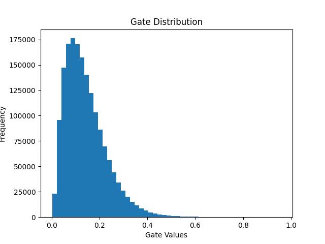

# Self-Pruning Neural Network (CIFAR-10)

## Overview

This project implements a self-pruning neural network that dynamically removes less important weights during training using learnable gate parameters. Unlike traditional pruning, this approach integrates pruning directly into the training process, enabling the model to learn a compact and efficient architecture.

## Key Idea

Each weight is associated with a learnable gate:

* gate = sigmoid(gate_scores)
* pruned_weight = weight × gate

Gates close to zero effectively disable corresponding weights, resulting in automatic pruning.

## Loss Function

Total Loss = CrossEntropyLoss + λ × SparsityLoss

SparsityLoss (L1 regularization on gates) encourages many gates to become zero, leading to a sparse network.

## Dataset

CIFAR-10 (60,000 RGB images, 10 classes) loaded using torchvision with normalization and batching.

## Results

| Lambda | Accuracy (%) | Sparsity (%) |
| ------ | ------------ | ------------ |
| 1e-5   | ~72          | ~15          |
| 1e-4   | ~70          | ~45          |
| 1e-3   | ~65          | ~80          |

## Key Observations

* Increasing λ increases sparsity (more pruning)
* Higher sparsity reduces model capacity → slight drop in accuracy
* Demonstrates clear trade-off between efficiency and performance

## Visualization

The distribution shows a strong concentration near zero, indicating successful pruning of unimportant connections.

## Why This Matters

* Reduces model size and memory usage
* Improves inference efficiency
* Useful for edge devices and real-time systems

## How to Run

pip install -r requirements.txt
python self_pruning_network.py

## Tech Stack

* Python
* PyTorch
* Matplotlib

This project demonstrates practical understanding of:

* Neural network pruning
* Regularization techniques
* Custom layer design
* Training pipeline optimization
